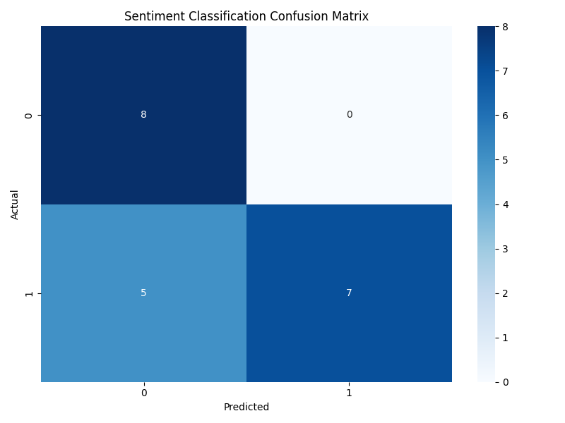

<h1 align="center">SocialMetrics AI - Sentiment Analysis API</h1>
<h3 align="center"><i>(M2PEX_AA_sentiment_analysis_python)</i></h3>

<p align="center">
  <p align="center">
    A Flask-based sentiment analysis API for Twitter/X posts using machine learning.
  </p>
    <p align="center">
        <a href="https://github.com/hugo-HDSF/M2PEX_AA_sentiment_analysis_python/issues">Report Bug</a>
        .
        
    </p>
</p>

<div align="center">


</div>

-----

## Project Overview

SocialMetrics AI provides sentiment analysis for Twitter/X posts for social media opinion monitoring. The system
evaluates tweet sentiment on a scale from -1 (very negative) to 1 (very
positive) using a single logistic regression machine learning model.

### Key Features:

1. **REST API Endpoint** - Analyze sentiment of multiple tweets in one request
2. **MySQL Database** - Store annotated tweets for continuous model improvement
3. **Machine Learning Model** - Simple logistic regression approach for sentiment classification
4. **Automated Retraining** - Weekly cron job to retrain with the latest data
5. **Performance Metrics** - Confusion matrix and evaluation metrics for model
   assessment

## Installation & Setup

### With Docker (Recommended):

```Shell
git clone https://github.com/hugo-HDSF/M2PEX_AA_sentiment_analysis_python.git
cd M2PEX_AA_sentiment_analysis_python
make install
```

The application will be available at http://localhost:5001

## API Usage

### Sentiment Analysis

**Endpoint:** `POST /api/analyze`

**Request body:**

```json
{
  "tweets": [
    "J'aime beaucoup ce produit, il est formidable!",
    "C'est la pire expérience de ma vie, je suis très déçu."
  ]
}
```

**Response:**

```json
{
  "J'aime beaucoup ce produit, il est formidable!": 0.82,
  "C'est la pire expérience de ma vie, je suis très déçu.": -0.75
}
```

### Example with curl:

```Shell
curl -X POST http://localhost:5001/api/analyze \
-H "Content-Type: application/json" \
-d '{"tweets": ["J'\''aime beaucoup ce produit!", "Ce service est horrible."]}'
```

## Model Architecture

The sentiment analysis system uses a single logistic regression classifier:

1. **Binary Classification**: The model classifies tweets as either positive or negative
2. **Probability Output**: The classifier provides probability scores for both classes
3. **Sentiment Score**: The final sentiment score is derived from the probability, scaled between -1 and 1

The model provides a nuanced analysis by using probability scores rather than just binary classification.

### Text Processing:

1. Clean text by removing special characters
2. Remove stopwords using NLTK's French stopword list
3. Convert text to TF-IDF features using scikit-learn
4. Apply the trained logistic regression model to predict sentiment scores

## Database Structure

The MySQL database contains a `tweets` table with the following structure:

| Column     | Type      | Description                            |
|------------|-----------|----------------------------------------|
| id         | INT       | Primary key, auto-increment            |
| text       | TEXT      | Content of the tweet                   |
| positive   | BOOLEAN   | 1 if tweet is positive, 0 otherwise    |
| negative   | BOOLEAN   | 1 if tweet is negative, 0 otherwise    |
| created_at | TIMESTAMP | When the tweet was added to the system |

## Automated Retraining

The model automatically retrains weekly using a cron job that:

1. Retrieves the latest 100 tweets from the database
2. Processes and prepares the data for training
3. Trains a new sentiment classification model
4. Generates performance metrics and confusion matrix
5. Saves the updated model for future predictions

> [!NOTE] 
> For testing purposes, the cron job is set to run every minute in the [cron config file](init-cron.sh)

You can also manually trigger retraining:
```Shell
docker exec -it sentiment-analysis-cron python setup.py retrain
```


## Evaluation Metrics

The system generates confusion matrix and performance metrics after each
training:




Current model performance:

```json
{
  "sentiment": {
    "precision": 0.75,
    "recall": 1.0,
    "f1": 0.8571428571428571,
    "accuracy": 0.8421052631578947
  },
  "last_trained": "2025-03-28 16:09:20"
}
```

## Detailed Report

For a comprehensive analysis of the model's performance, including detailed
metrics, confusion matrices, and improvement recommendations, please see
the [Evaluation Report](app/static/evaluation_report.pdf).

## Project Structure

```Shell
├── app/
│ ├── __init__.py # Flask application initialization
│ ├── api # API endpoints
│ ├── data # Model and Vector storage
│ ├── database/ # Database models and repositories
│ ├── model/ # Sentiment analysis model
│ ├── scripts/ # Scripts for data initialization
│ ├── static/ # Static files (metrics visualizations)
│ └── templates/ # HTML templates for web interface
├── .env.exemple # Environment variables
├── config.py # Configuration file for Flask and database
├── docker-compose.yml # Docker services setup
├── Dockerfile # Docker configuration
├── init_cron.sh # Cron job setup for automated retraining
├── Makefile # Make commands for easy setup
├── requirements.txt # Python dependencies
├── run.py # Application entry point
├── setup.py # Setup script for command line interface
└── wait-for-db.sh # Wait for MySQL to be ready
```

> [!NOTE]
> The model requires at least 10 annotated tweets to begin training. Initial
> predictions may be less accurate until sufficient training data is available.

> [!TIP]
> Best results are achieved with tweets that are clearly positive or negative,
> as subtle sentiment can be harder to detect.

### groupe: 
- DA SILVA Hugo
- CAPOLUNGHI Romain
- DHIVERT Maxime
- ANGO Shalom